# E2E Test Report

## Auto Update
The app successfully detects the mock v0.0.2 release and displays the update dialog.

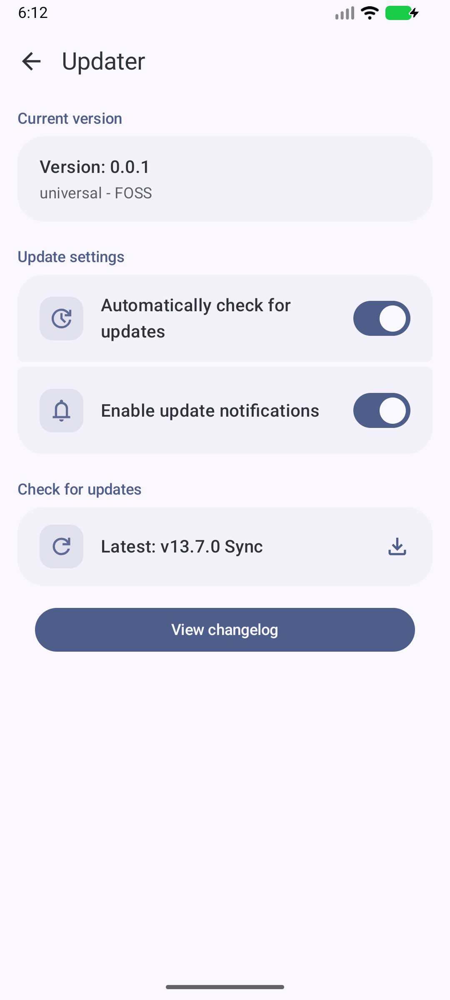

## Playback
Audio playback functions correctly with a mini-player and an expanded player.
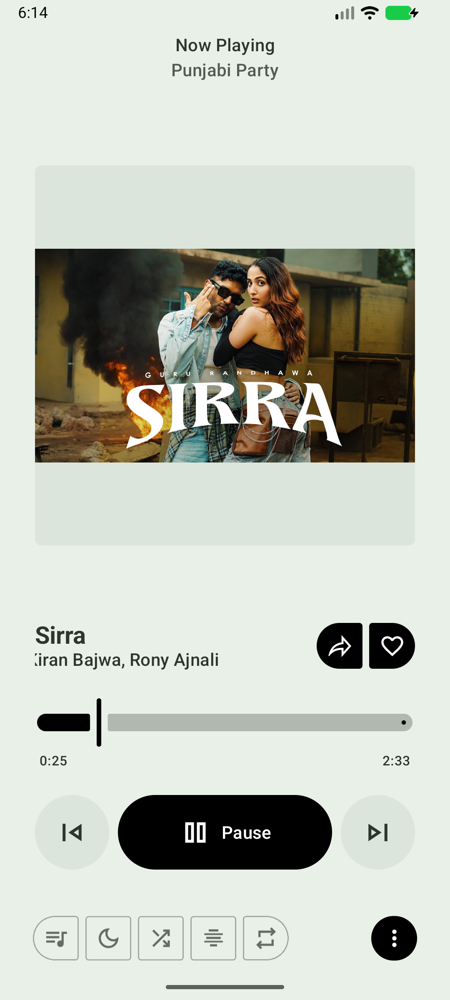
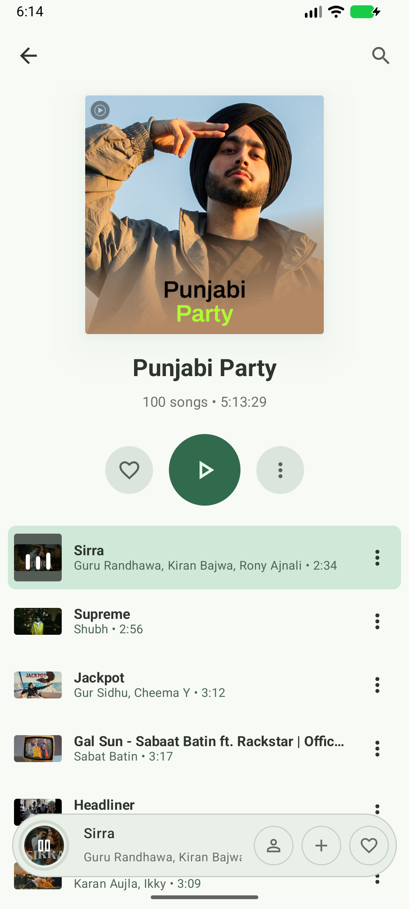

## Home
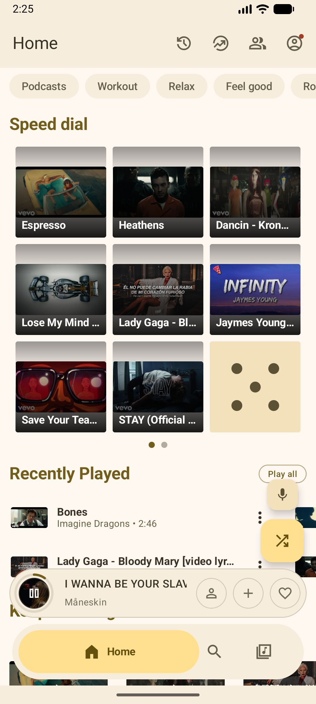
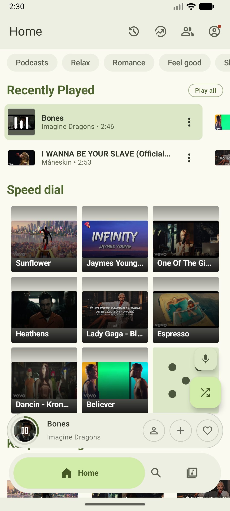

## Settings Screen
The various settings pages were accessed and confirmed to render correctly.

### Main Settings
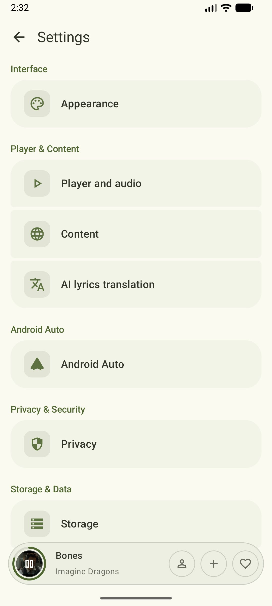

### Player & Audio

### Content
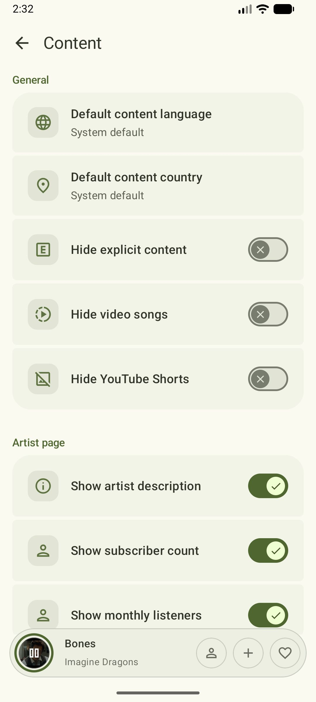

### Appearance
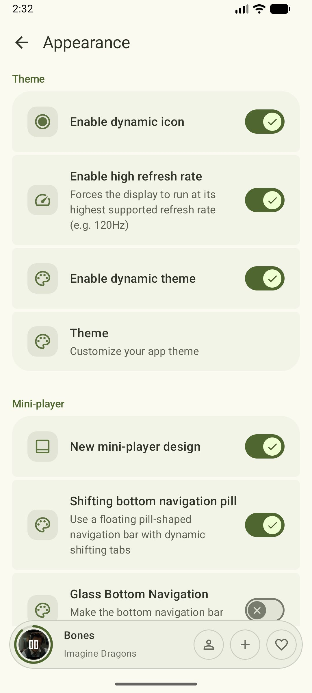

### AI Lyrics
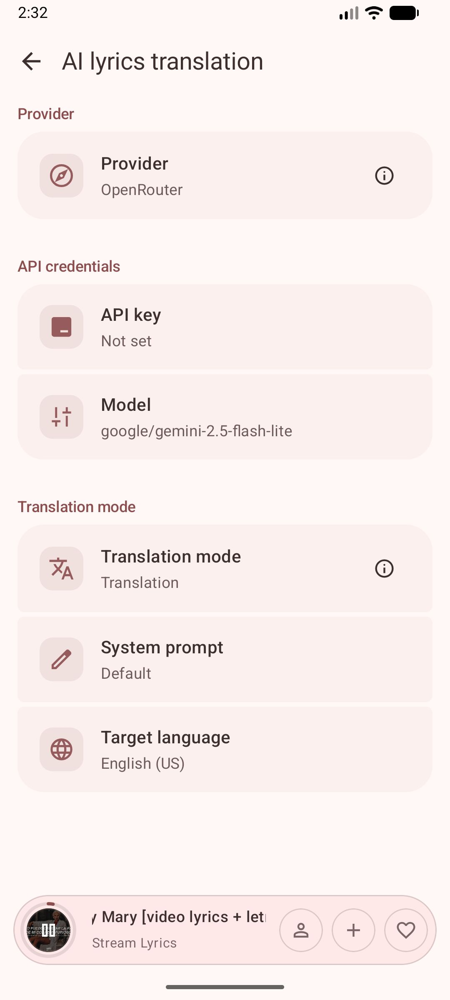

### Android Auto
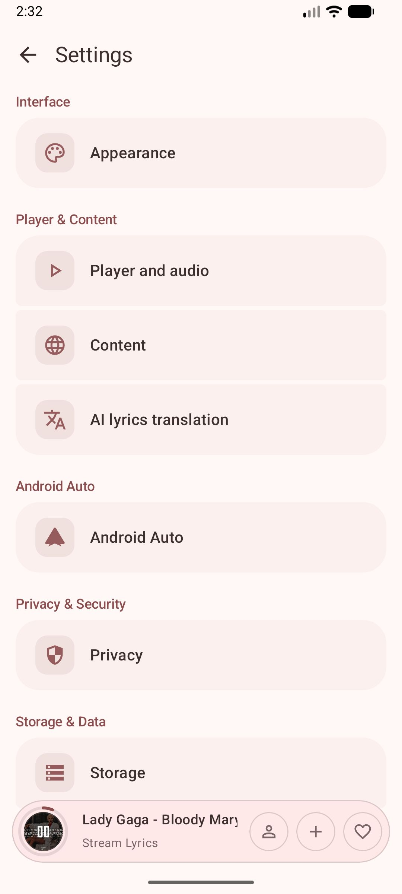

### Privacy

### Storage
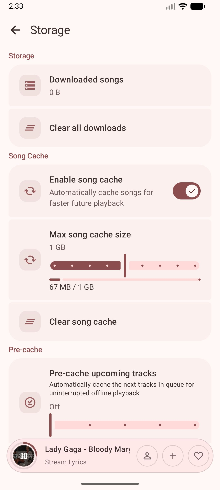
