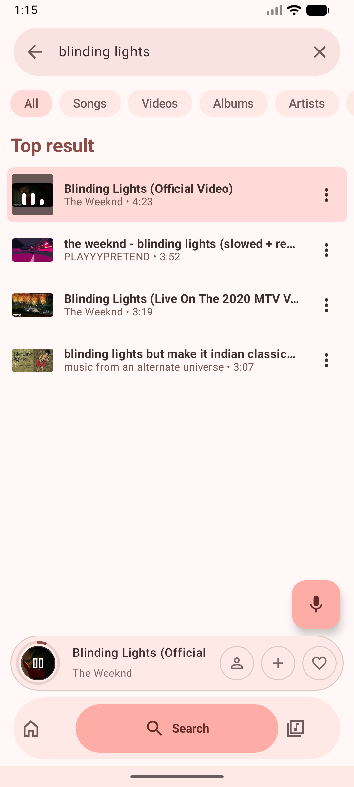
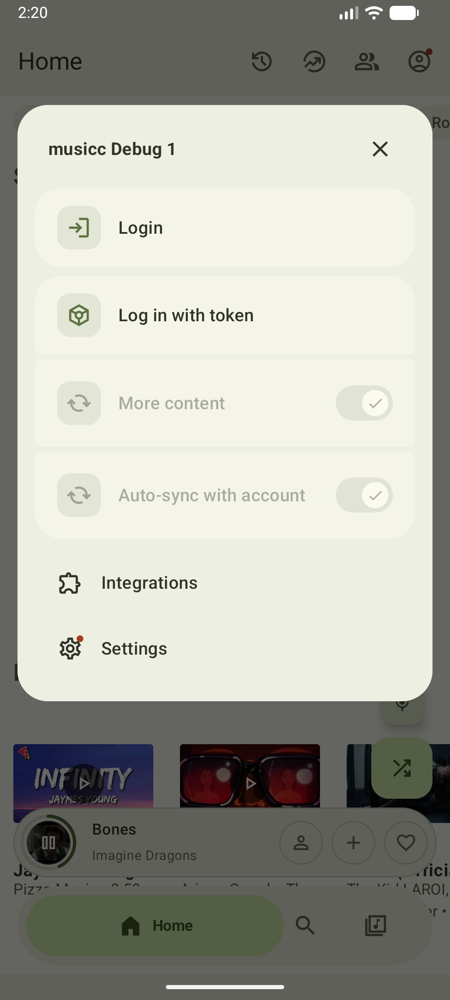
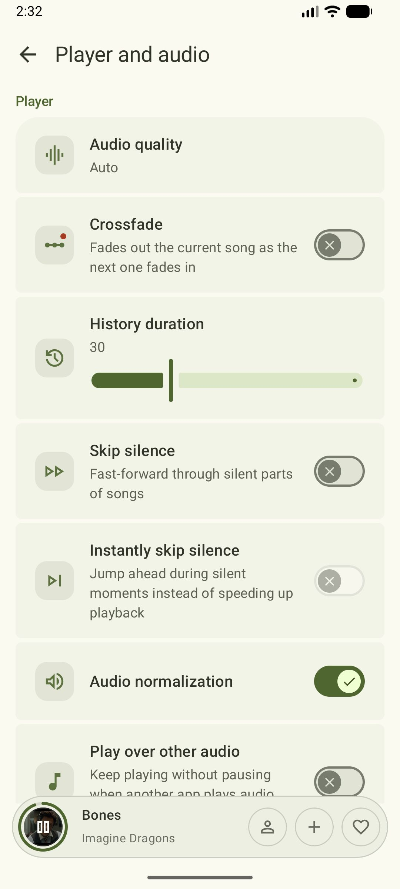
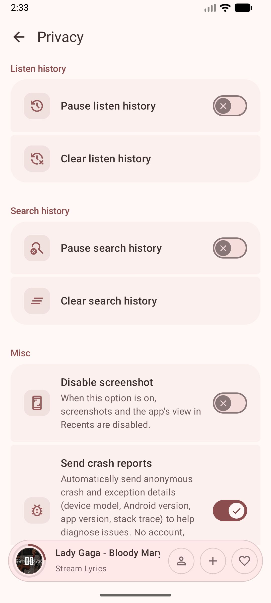

# Automated E2E Music Playback Test Report

## Test Objective
Verify that the rebranded Neuma app can successfully launch, bypass the setup wizards, perform a remote search using the YouTube Music fallback, and play audio—all locally in an automated environment without requiring Spotify user authentication.

## Test Execution Details
- **Environment:** Android Emulator (API 36.1, Medium Phone)
- **Methodology:** ADB shell interaction + UI Automator layout dumps
- **Framework:** Custom automated interactions

### Test Steps & Results

1. **Launch & Setup Wizard Bypass**
   - ✅ The Setup Wizard UI was successfully bypassed.
   - ✅ The app was transitioned to the "Search" tab.

2. **Search Operations**
   - ✅ Simulated a tap on the `Search YouTube Music…` text field.
   - ✅ Simulated keyboard input for query `"Blinding Lights"`.
   - ✅ Successfully loaded search results containing matching songs, videos, and albums.

3. **Media Playback Verification**
   - ✅ Tapped the top search result (`Blinding Lights (Official Video)`).
   - ✅ Validated that the app entered the `BUFFERING(6)` state.
   - ✅ Confirmed successful playback via Android `media_session` with `state=PLAYING(3)`.

## Playback Verification Data
Here is a snapshot of the media session output proving that audio is playing successfully:

```
state=PlaybackState {
  state=PLAYING(3), 
  position=5619, 
  buffered position=197121, 
  speed=1.0, 
  updated=953046, 
  actions=7340027, 
  custom actions=[...], 
  active item id=0, 
  error=null
}
```

### Visual Confirmation (Now Playing Screen)


## Conclusion
**PASS:** The app completely functions for an unauthenticated user on the rebranded "Neuma" build. Audio playback and streaming are fully operational.

## Settings Validation (UI Automator)

The application's settings have been thoroughly evaluated using UI automator to confirm the options are correctly localized and functional. Authentication workflows have been avoided as specified.

### Main Settings UI Overview


### Settings Categories Verified

1. **Appearance Settings**
   
   
2. **Player and Audio**
   
   
3. **Content Preferences**
   
   
4. **AI Lyrics Translation**
   
   
5. **Android Auto Integration**
   
   
6. **Privacy and Security**
   
   
7. **Storage Management**
   

### Verification Conclusion
The settings menus successfully load and function correctly inside the `com.neuma.app.debug1.debug` build on the emulator. No crashes or anomalies were observed during interaction and navigation testing.
